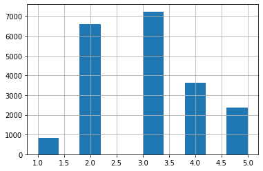
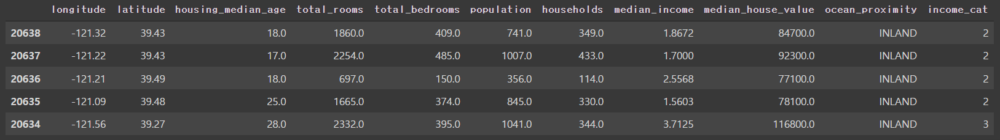
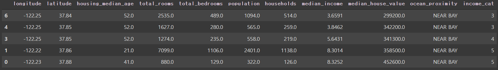

# 머신러닝 Machine-Learning

**AI (Artificial Intelligence) > 머신러닝(Machine-Learning) > 딥러닝 (Deep Learning)**


## 머신러닝의 정의와 목표

> 데이터의 패턴을 학습시켜서 컴퓨터 스스로 생각할수있는 방법을 가르치는것


+ 머신러닝은 데이터의 패턴을 학습한다
+ 대용량의 데이터로부터 데이터의 패턴을 찾아내는 과정을 **데이터 마이닝** 이라고 한다


## 머신러닝의 종류

+ **지도학습**
  + `문제(feature)` 와 `정답(label)` 을 주고 컴퓨터가 학습하게끔한다
  + 보통 `분류` 와 `회귀 `문제를 다룬다
    + `분류`: 카테고리를 맞추는 문제
      + **이진분류** : 둘 중 하나
      + **다중분류** : 분류해야될 대상이 여러개
    + `회귀` : 연속적인 값을 예측하는 문제


+ **비지도학습**
  + `문제` 만 주는 학습방법
  + `군집`, `시각화`,`차원축소`, `이상치 데이터 구분` 
    + `군집` : 연관성이 있는 데이터를 묶어내는것
    + `시각화` : 데이터를 파악하기 쉽게 시각적으로 표현
    + `차원축소` : 데이터의 양을 적절히 조절하여 데이터를 중요한 부분만 표현할수있게 하는것
    + `이상치 데이터 구분` : 연관성이 없는 이상치 데이터 구분


+ **준지도학습**
  + 지도학습과 비지도학습을 모두 사용함
  + 비지도학습을 활용해 군집을 만들고 그 군집내에서 지도학습으로 예측을 한다


+ **강화학습**
  + 컴퓨터가 스스로 보상과 벌점의 개념을 활용해 학습한다


## 데이터의 일반화

> 머신러닝을 하는 가장 큰 목적


+ **일반화**

  + 일반화란 새로운 데이터에도 출력에 대한 성능차이가 나지 않게 머신이 잘 적응해야한다는 개념
  + `과대적합` , `과소적합`
    + `과대적합` : 데이터의 패턴을 과도하게 분석하는것
    + `과소적합` : 데이터를 면밀하게 분석하지 못하는것
  + 목표 : 일반화 성능이 최대가 되는 모델을 만드는것

  


​	

**일반화가 잘된 모델인지 잘 되지못한 모델인지는 일반화지점으로 판단한다. 일반화 지점이 판단의 기준이 된다**


## GIGO (Garbage In Garbage Out)

> 머신러닝에서 제일 중요한 요소 중 하나는 깨끗한 데이터를 사용하는것
>
> 똑같은 데이터 세트를 사용하더라도 데이터의 전처리나 분석방법등에 따라서 성능이 차이가 나게 된다


# 캘리포니아 데이터로 머신러닝 이해해보기

> 가설: 해변가 근처에 사는 집들의 집값은 더 비싸다


## 1.데이터 다운받고 데이터 세트를 확인

 ```python
 import pandas as pd
 
 def load_housing_data(housing_path=HOUSING_PATH, filename="housing.csv"):
   csv_path = os.path.join(housing_path, filename)
   return pd.read_csv(csv_path) # 데이터 프레임 리턴
 
 housing =  load_housing_data()
 housing.head()
 ```

결과

<table>
    <tr>
        <th></th>
        <th>longitude</th>
        <th>latitude</th>
        <th>housing_median_age</th>
        <th>total_rooms</th>
        <th>total_bedrooms</th>
        <th>population</th>
        <th>households</th>
        <th>median_income</th>
        <th>median_house_value</th>
        <th>ocean_proximity</th>
    </tr>
    <tr>
        <th>0</th>
        <th>-122.23</th>
        <th>37.88</th>
        <th>41.0</th>
        <th>880.0</th>
        <th>129.0</th>
        <th>322.0</th>
        <th>126.0</th>
        <th>8.3252</th>
        <th>452600.0</th>
        <th>NEAR BAY</th>
    </tr>
    <tr>
        <th>1</th>
        <th>-122.22</th>
        <th>37.86</th>
        <th>21.0</th>
        <th>7099.0</th>
        <th>1106.0</th>
        <th>2401.0</th>
        <th>1138.0</th>
        <th>8.3014</th>
        <th>358500.0</th>
        <th>NEAR BAY</th>
    </tr>
    <tr>
        <th>2</th>
        <th>-122.24</th>
        <th>37.85</th>
        <th>52.0</th>
        <th>1467.0</th>
        <th>190.0</th>
        <th>496.0</th>
        <th>177.0</th>
        <th>7.2574</th>
        <th>352100.0</th>
        <th>NEAR BAY</th>
    </tr>
    <tr>
        <th>3</th>
        <th>-122.25</th>
        <th>37.85</th>
        <th>52.0</th>
        <th>1274.0</th>
        <th>235.0</th>
        <th>558.0</th>
        <th>219.0</th>
        <th>5.6431</th>
        <th>341300.0</th>
        <th>NEAR BAY</th>
    </tr>
    <tr>
        <th>4</th>
        <th>-122.25</th>
        <th>37.85</th>
        <th>52.0</th>
        <th>1627.0</th>
        <th>280.0</th>
        <th>565.0</th>
        <th>259.0</th>
        <th>3.8462</th>
        <th>342200.0</th>
        <th>NEAR BAY</th>
    </tr>
</table>

  

**데이터프레임의 기본정보 확인하기**

```python
housing.info()
```

결과

```python
<class 'pandas.core.frame.DataFrame'>
RangeIndex: 20640 entries, 0 to 20639
Data columns (total 10 columns):
 #   Column              Non-Null Count  Dtype  
---  ------              --------------  -----  
 0   longitude           20640 non-null  float64
 1   latitude            20640 non-null  float64
 2   housing_median_age  20640 non-null  float64
 3   total_rooms         20640 non-null  float64
 4   total_bedrooms      20433 non-null  float64
 5   population          20640 non-null  float64
 6   households          20640 non-null  float64
 7   median_income       20640 non-null  float64
 8   median_house_value  20640 non-null  float64
 9   ocean_proximity     20640 non-null  object 
dtypes: float64(9), object(1)
memory usage: 1.6+ MB
```


**데이터프레임의 통계적 특성 확인**

```python
housing.describe()
```

결과


**데이터 형태 (분포) 확인-시각화**

```python
import matplotlib.pyplot as plt

housing.hist(bins=50, figsize=(20, 15) )
plt.show()
```

결과


**housing_median_age 는 밸런스가 잘잡혀있다는걸 확인할수있다**

**median_house_value 는 끝에 5000000 영역에 이상치가 몰려있는걸 확인할수있는데 이상치데이터들을 5000000 로 통일했을것으로 추정할수있다**

**그리고 median_income의 경우 집값 데이터와 그래프의 형태가 비슷한걸로 보아 둘이 상관관계가 있어보인다**


## 2.테스트 데이터세트 만들기

+ **테스트 세트란?**

  + 데이터세트를 만드는 일은 데이터를 받아 머신러닝을 하기전 가장먼저 해야하는 작업이다.

  + 머신러닝 모델을 구동할때 가지고 있는 데이터의 100% 를 모두 돌리는게 아니라 70 에서 80% 정도는 훈련세트, 20 에서 30% 는 테스트 세트로 나누어 

    훈련세트를 머신러닝에게 전달한다.

  + 테스트 세트는 런칭 직전에 최종테스트를 할때 사용한다.
  + 전체데이터를 전부 사용해 훈련해 새로운 데이터에 대한 예측이 잘 안되는 현상을 `데이터 스누핑` 이라고 한다.
  + 최종 테스트할때 테스트 세트를 사용하는데 이때 발생하는 오차를 `일반화 오차` 라고한다.


### 데이터 쪼개기

> 데이터를 훈련세트와 테스트 세트로 쪼갤것
>
> 대신 그냥 짜르면 안되고 전체 데이터를 한번 섞고(shuffle) 잘라야한다(split)


**데이터를 쪼개는 여러방법**

1. 단순하게 무작위로 랜덤 돌려서 쪼개기
2. 랜덤 고정(random seed)을 이용해 짜르기
3. hash 값을 구하여 잘라내기
4. 머신러닝 라이브러리 사이킷런(scikit-learn) 에 있는 함수 `train_test_split`  이용하기
5. 사이킷런 에 있는 함수 중 계층적 샘플링까지 가능한 `StratifiedShuffleSplit` 함수 사용하기

여기서 4번 방법을 사용해보고 5번 방법으로도 데이터를 쪼개볼것이다.


#### train_test_split

```python
pip install scikit-learn

from sklearn.model_selection import train_test_split

train_set, test_set = train_test_split(
    housing,       # split할 데이터 세트
    test_size=0.2,  # 테스트 세트의 크기
    random_state=42 # 랜덤 시드 지정
)
```

이렇게 4번 방법으로 해도 되긴하지만 이 데이터 세트에선 좋은 방법이 아니다. 그이유는 데이터 시각화한것의 모습을 보면 다수의 시리즈들이 한쪽으로 치우쳐진 **꼬리분포의 형태가 많기 때문에** 아무리 셔플해서 쪼갠다고해도 치우쳐진쪽의 데이터가 더 많이 들어가게 됨으로 **<u>샘플링 편향</u> **이 일어날 가능성이 높다


**따라서 데이터들이 골고루 분배되게끔 `계층적 샘플링`이 필요하다**


#### StratifiedShuffleSplit (계층적 샘플링)

> 보통은 단순 훈련세트와 테스트세트를 만들때 보다는 검증세트를 만들때 사용한다.


**구간을 먼저 만들어준다**

```python
housing["income_cat"] = pd.cut(
    housing["median_income"], # 구간을 나눌 대상이 되는 시리즈
    bins=[0.0, 1.5, 3.0, 4.5, 6.0, np.inf], # 구간 나누기
    labels=[1,2,3,4,5]
)
housing[['median_income','income_cat']].head(10)
```

`pd.cut()`[^1] 를 이용해서 구간을 만든다.

결과

<table>
    <tr>
        <th></th>
        <th>median_income</th>
        <th>income_cat</th>
    </tr>
    <tr>
        <th>0</th>
        <th>8.3252</th>
        <th>5</th>
    </tr>
    <tr>
        <th>1</th>
        <th>8.3014</th>
        <th>5</th>
    </tr>
    <tr>
        <th>2</th>
        <th>7.2574</th>
        <th>5</th>
    </tr>
    <tr>
        <th>3</th>
        <th>5.6431</th>
        <th>4</th>
    </tr>
    <tr>
        <th>4</th>
        <th>3.8462</th>
        <th>3</th>
    </tr>
    <tr>
        <th>5</th>
        <th>4.0368</th>
        <th>3</th>
    </tr>
    <tr>
        <th>6</th>
        <th>3.6591</th>
        <th>3</th>
    </tr>
    <tr>
        <th>7</th>
        <th>3.1200</th>
        <th>3</th>
    </tr>
    <tr>
        <th>8</th>
        <th>2.0804</th>
        <th>2</th>
    </tr>
    <tr>
        <th>9</th>
        <th>3.6912</th>
        <th>3</th>
    </tr>
</table>


**시각화 해서 확인**

```python
housing["income_cat"].hist()
```

결과




**계층적 샘플링하기**

```python
from sklearn.model_selection import StratifiedShuffleSplit

spliter = StratifiedShuffleSplit(n_splits=1, test_size=0.2, random_state=42)

result = spliter.split(
    housing, # 자를 대상 데이터
    housing['income_cat']) # 잘라질 계층 데이터
for train_idx, test_idx in result:
  strat_train_set = housing.loc[train_idx]
  strat_test_set  = housing.loc[test_idx]
    
strat_train_set.sort_index(ascending=False).head(5)
```

결과



 우연히 행번호가 연속으로 붙어있는걸로 나왔지만 갯수를 확인해보면 **16512 rows × 11 columns** 로 잘 나온다.


##### 또다른 계층적샘플링 방법

**간단하게 train_test_split 이용하기**

```python
# train_test_split 에 계층적 분할을 위한 옵션 stratify 옵션이 있다.
train_set, test_set = train_test_split(housing,
                                       test_size=0.2,
                                       stratify=housing["income_cat"])

train_set.sort_index(ascending=False).tail(5)
```

결과




## 3.시각화하기


[^1]: cut 함수는 데이터를 동일한 길이로 나누는 함수이고, qcut 함수는 동일한 갯수로 나누는 함수이다. 아규먼트로는 [데이터, 구간의 갯수, 레이블명] 을 넣어준다. 구간의 갯수를 넣는곳에는 bins를 사용할수도 있고 단순 정수 3 이런식으로 넣어줘도된다.
